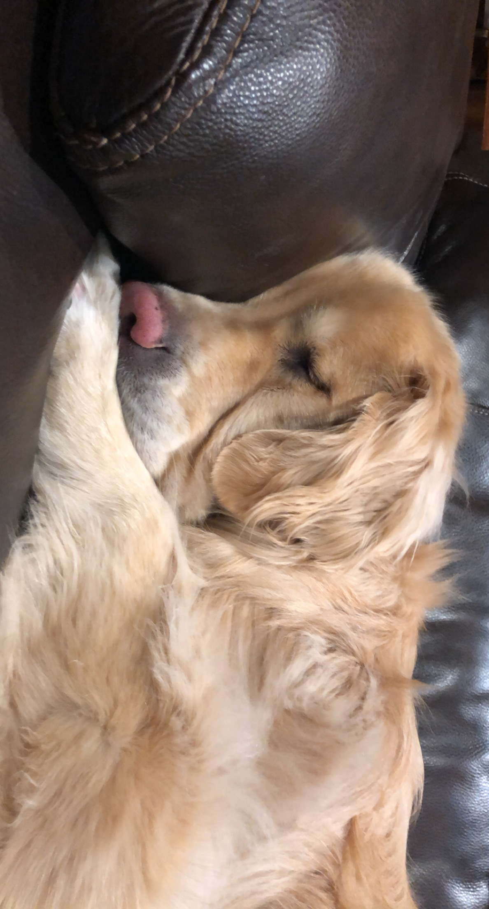

### Education + Experience

- 2016 - 2020 -- Carmel HS
  - 4.51 Weighted / 4.0 Unweighted GPA
  - Robotics Team, Math Team, Spikeball Club
  - National Merit Semi-Finalist, Mu Alpha Theta Math Honors Society
- 2020 - present -- University of Michigan - Ann Arbor
  - Computer Science and Engineering
  - Singleton Prize for Academic Excellence (4.0 GPA)
  - Current GPA: 3.90
- 2016 - 2020 -- FTC Robotics Team NYAN #10091
    - Programming Lead 2017-2020
    - Team Captain 2020
    - World Control Award Winners 2018
    - World Championship Winners 2019
- 2018, 2019 -- Internship at Digital Design Corporation
  - Computer Vision
  - HDL
  - Desktop App (Electron + Python)
  - NN Classifier
### Personal Projects and Experience
- Spikeball Ranking Algorithm [Completed]
  - Power Rating inspired by FRC's OPR ranking algorithm.
  - Python, Hidden Information, Statistics, Data Analysis, Google Sheets API
- Spikeball Ranking Display WebApp [WIP]
  - Reactive WebApp that displays current ranking, generates teams and matches, and allows match data input.
  - ReactJS, Django, REST API, SQLite, AJAX, HTML/CSS/JS
- Automatic Zoom Question Answerer [Completed]
  - Scraped Discord for overall consensus on questions (collaboration was permitted) and automatically submitted the answer on iClicker.
  - Python, BS4, Web Scraping, Automated Web Query Submission
- Micromouse Robot Prototype [WIP]
  - C, Embedded Programming, Control Theory, Maze-Solving/Path-Finding
- Various Algorithm Animations + Simulations [Completed]
  - TSP, Simulated Annealing, Flood-Fill, Etc.
- Competitive Programming [Completed]
  - Google Hashcode, Google Codejam, C1 Terminal

### My Dog
I have a Golden Retriever named Rolo 🐶

